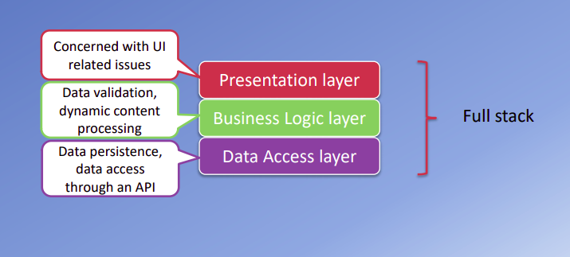
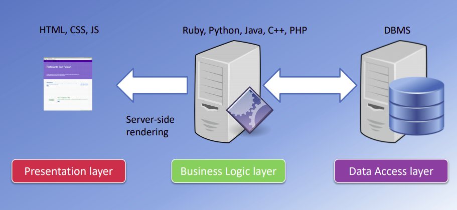
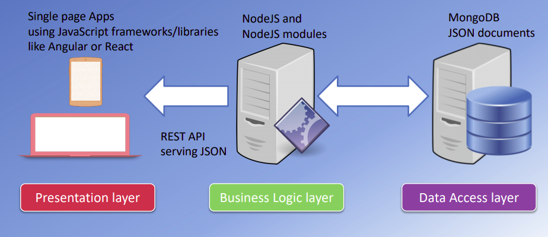

JavaScript has come long way in the last 20 years. JavaScript engine were orginally used only in web browsers, but they are now embedded even in some servers, usually via [Node.js](https://nodejs.org/en/). This evolution has made JavaScript a universal language.

<h2>Whai is Full Stack Web Development?</h2>

Full Stack is the development of both front end/client-side and back end/server-side. Full Stack Web Development can be divided into three major layers: presentation layer, business logic layer, and data access layer. Presentation layer handles UI/UX, business logic layer deals with dyanamic data processing, and data access layer provides data acesss through an API.

<h2>How to Become a Full Stack Web Developer?</h2>

Firstly, developer should have knowledge of front end technologies like [ BootStrap ](https://getbootstrap.com/), [Javascript](https://www.javascript.com/), [React](https://reactjs.org/), [Angular](https://angular.io/) or [Vue](https://vuejs.org/) in addition to HTML and CSS. Secondly, they should be equally good with backend tools like [Node.js](https://nodejs.org/en/), [Django](https://www.djangoproject.com/), [Express](https://expressjs.com/) and language like [Python](https://www.python.org/), [ASP.NET](https://dotnet.microsoft.com/apps/aspnet), [Java](https://www.java.com/en/), [C++](https://en.wikipedia.org/wiki/C%2B%2B#:~:text=Before%20the%20initial%20standardization%20in,level%20features%20for%20program%20organization.), [PHP](https://www.php.net/). Finally,they are also required to have knowledge of databases like [SQL](https://en.wikipedia.org/wiki/SQL), [MYSQL](https://www.mysql.com/), [SQLite](https://www.sqlite.org/index.html) or [MongoDB](https://www.mongodb.com/).

Further, a Full Stack developer can specialize into one or many software stack.For instance:

1:  MEAN Stack: MONGO | EXPRESS | ANGULAR| NODE

2: MERN Stack: MONGO | EXPRESS | REACT| NODE

3: MEVN Stack: MONGO | EXPRESS | VUE | NODE

4: LAMP Stack: LINUX | APACHE | MYSQL | PHP

5: Django Stack: JAVASCRIPT | PYTHON | DJANGO | MYSQL

<h2>Javascript Full Stack</h2>

Learning various languages can be cumbersome at times. This is where JavaScript comes in. In JavaScript Full Stack, presentaion layer is built using JavaScript frameworks, such as: [React](https://reactjs.org/), [Angular](https://angular.io/) or [Vue](https://vuejs.org/). Similarly, business logic layer is constructed with [Node.js](https://nodejs.org/en/) and node-modules to communicate with front end using REST API serving JSON. Finally, [MongoDB](https://www.mongodb.com/) is used in data access layer.

There's trade-off everywhere. JavaScript Full Stack Web Dev is no exception.

**Pros**
- Prototype can be build rapidly.
- Common language, better team efficiency with less resources.
- Code reusability.
- Can switch between front and back end development based on requirements.

**Cons**
- Node.js is not recommended for heavy backend computation and data processing.
- Jack of all trades, master of none? May be.
