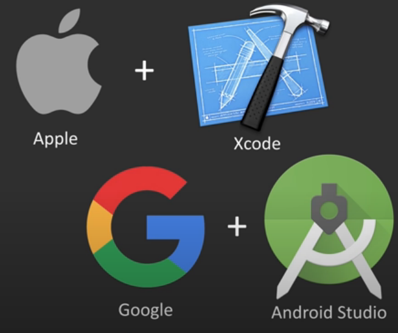
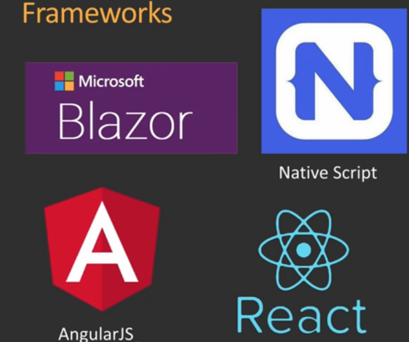
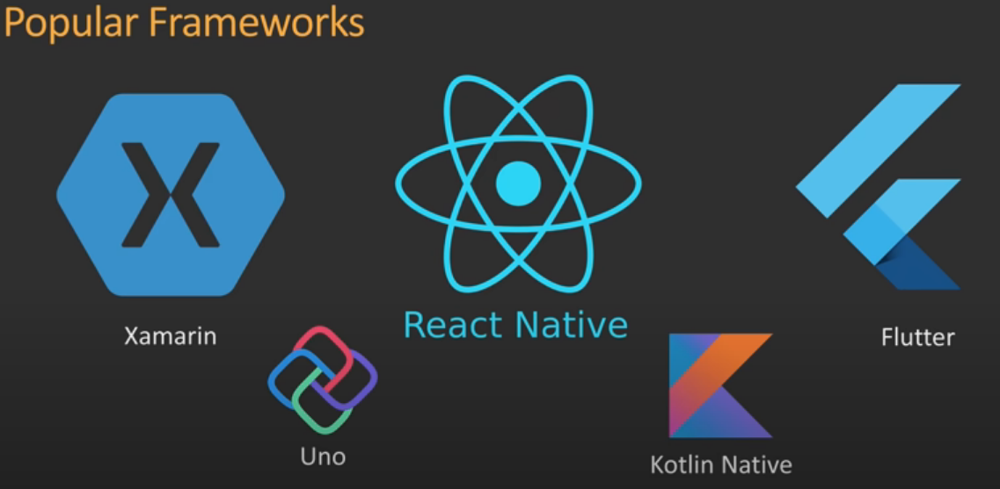

Choosing a mobile develpoment framework can be daunting at times.There are many option and consideration to make outside the framework.

**Consideration:**
- Time to Market
- Development Cost
- Maintaince Cost
- App Performance
- Feature Availabilty
- 3rd Party Risk

<h2>1st Party Native App:</h2>

[Google](https://www.google.com/) [Android](https://www.android.com/) and [Apple](https://www.apple.com/) [iOS](https://developer.apple.com/ios/) are leading mobile operating system. Android is the leading mobile OS market with almost 75 percent share. Both Android and iOS jointly possess almost 99 percent of global market share.

Apple makes [Xcode](https://developer.apple.com/xcode/) development toolkit that allows us to develop iOS app using [ Objective-C
](https://developer.apple.com/library/archive/documentation/Cocoa/Conceptual/ProgrammingWithObjectiveC/Introduction/Introduction.html) and [Swift](https://developer.apple.com/swift/).Similary, Android App can be developed using [Android Studio](https://developer.android.com/studio) using [Java](https://www.java.com/en/) and [Kotlin](https://kotlinlang.org/).Merits of using 1st Party Native includes:

- Native UI/UX
- New feature or API right after release

<h2>Progressive Web App</h2>

Progressive Web App is an app built from the web technologies like HTML, CSS, and [JavaScript](https://www.javascript.com/), but with a feel and functionality that rivals an actual native app.Frameworks includes: [Angularjs](https://angularjs.org/), [React](https://reactjs.org/).

**Demerits**
- Slower than native app
- UI/UX limitation

**Merits**
- Cheaper to develop,deploy
- Require less storage
- No store required

<h2>Cross-Platform Native Apps</h2>

Cross-Platform Native Apps are created using Xamarin,React Native,Flutter. These frameworks not only allows us to create totally native application that gives us access to every single iOS and Android API but also allows us to write the app in same code base so that we can share code between iOS and Android.

- **Microsoft**
    - [Xamarin](https://dotnet.microsoft.com/apps/xamarin/)
    - Language: .NET, C#, F#
- **Facebook**
    - [React Native](https://reactnative.dev/)    
    - Language: JavaScript
- **Google**
    - [Flutter](https://flutter.dev/)
    - Language: [DART](https://dart.dev/)    

